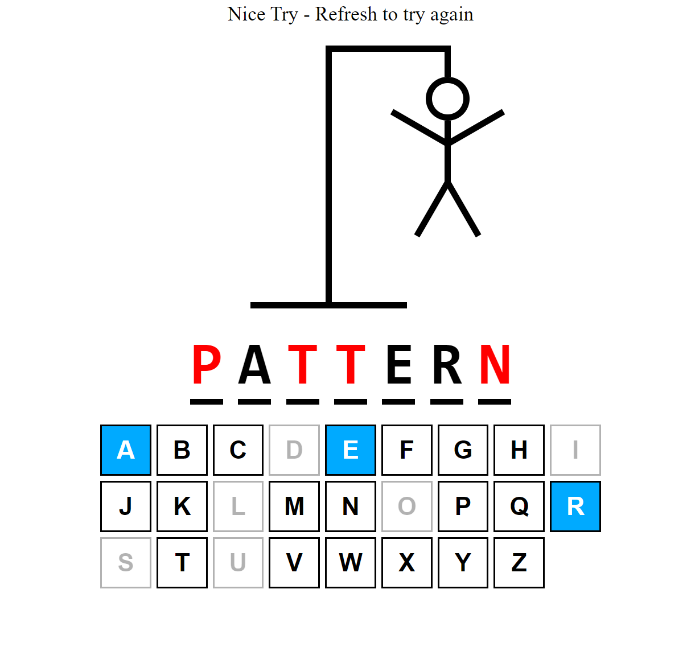
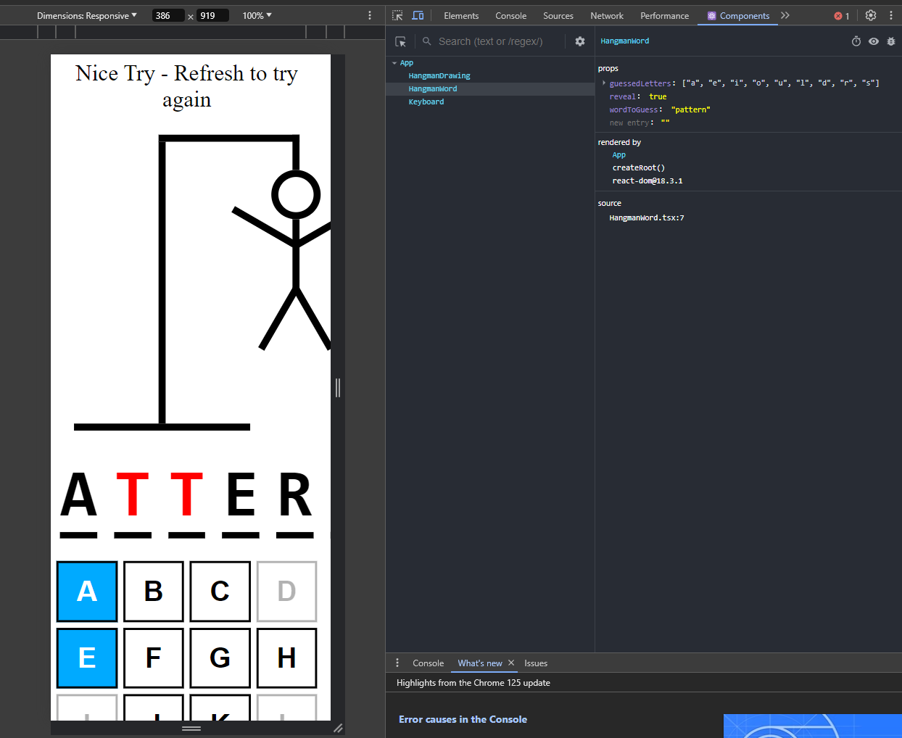

# Hangman Game

Welcome to the Hangman Game, a fun and interactive way to enhance your vocabulary and coding terms knowledge! Built with React, this game challenges players to guess words related to software development, computing, and more, all while trying to save the hangman from his fate!



## Features

- **Interactive Gameplay**: Play by guessing letters to fill in the word blanks.
- **Dynamic Word Generation**: Each game pulls a random word from a predefined list of technical and computing terms.
- **Visual Feedback**: Includes visual cues for correct and incorrect guesses, and displays hangman's progress as guesses evolve.
- **Keyboard Support**: Play entirely with your keyboard for a seamless gaming experience.
- **Responsive Design**: Enjoy the game on any device, adapting perfectly to different screen sizes.

## Installation

To get started with your own instance of the Hangman game, follow these steps:

1. Clone the repository:
   ```bash
   git clone https://github.com/your-username/hangman-game.git
   ```
2. Navigate to the project directory:
   ```bash
   cd hangman-game
   ```
3. Install the dependencies:
   ```bash
   npm install
   ```
4. Start the application:
   ```bash
   npm start
   ```

## Usage

After launching the game, you will be presented with a set of blank spaces representing the letters of a randomly selected word from the list. Here’s how to play:

- Use your keyboard to input guesses.
- The game tracks your progress by filling in correct guesses and drawing parts of the hangman for incorrect guesses.
- You win by guessing the word before the hangman is fully drawn.
- Press `Enter` to start a new game after a win or loss.

## Components

The game is built using several React components:
- **HangmanDrawing**: Displays the hangman's progress based on incorrect guesses.
- **HangmanWord**: Shows the word to be guessed with blanks filled as correct guesses are made.
- **Keyboard**: Displays a virtual keyboard with interactive keys for guessing.



## Credits

- **React**: Used for building the user interface.
- **Words API**: Provides the list of words used in the game.

Thank you for playing the Hangman game! If you have any feedback or suggestions, please feel free to contribute to the project.

---

Enjoy the game and sharpen your technical vocabulary!
